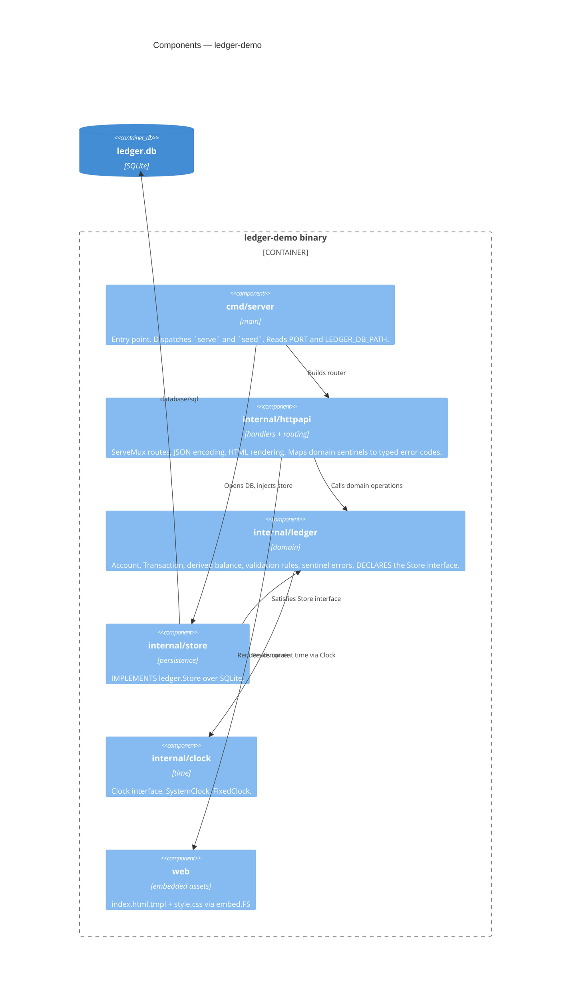

# C4 Level 3 — Components

**Status:** Skeleton. `internal/ledger`, `internal/store`, and `internal/clock` are currently
empty placeholders — the domain is built during the demo. The dependency arrows below are the
*intended* structure and are already enforced by the package layout.

## The dependency rule that matters

`internal/store` depends on `internal/ledger`, **not the reverse**. The `Store` interface is
declared in the domain package and implemented in the store package, so the domain has no
knowledge of SQLite and unit-tests against a trivial in-memory fake.

See `.docs/decisions/adr-2026-08-08-store-interface-in-domain-package.md`.

## Current state

| Package | State |
|---|---|
| `cmd/server` | Serves; `seed` is a stub that reports it has nothing to load |
| `internal/httpapi` | `NewRouter()` wires `GET /` and `GET /style.css` only |
| `internal/ledger` | Empty — doc comment describing intended contents |
| `internal/store` | Empty — blank driver import pins `modernc.org/sqlite` for offline builds |
| `internal/clock` | Empty — doc comment only |
| `web` | Complete for the scaffold: stub page + projector-legible CSS |
