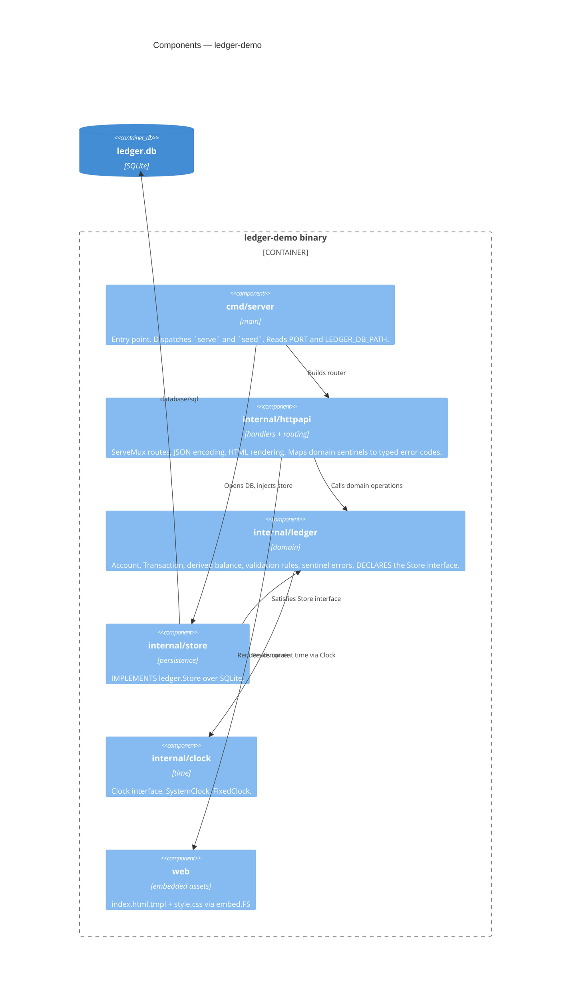

# C4 Level 3 — Components

**Last updated:** 2026-08-08
**Scope:** Packages inside the single binary, and the dependency direction between them.
**Status:** Planned. `internal/ledger`, `internal/store`, and `internal/clock` currently hold only
doc comments; the approved base-ledger spec (`.docs/specs/2026-08-08-base-ledger.md`) specifies
their contents as the work to be built. The dependency arrows below are already enforced by the
package layout and do not change.

## The dependency rule that matters

`internal/store` depends on `internal/ledger`, **not the reverse**. The `Store` interface is
declared in the domain package and implemented in the store package, so the domain has no
knowledge of SQLite and unit-tests against a trivial in-memory fake.

See `.docs/decisions/adr-2026-08-08-store-interface-in-domain-package.md`.

## State, and what base-ledger adds

| Package | Today | After base-ledger |
|---|---|---|
| `cmd/server` | Serves; `seed` reports it has nothing to load | `seed` loads 3 accounts with 8–12 transactions each, fixed timestamps; opens the DB and injects the store |
| `internal/httpapi` | `NewRouter()` wires `GET /` and `GET /style.css` | All five routes; renders the page with selector, balance, form, list, and a visible error panel; maps domain sentinels to the codes in `.docs/decisions/api-response-contract.md` |
| `internal/ledger` | Doc comment only | `Account`, `Transaction`, derived balance, the six validation rules, the sentinel errors, and the `Store` interface declaration |
| `internal/store` | Blank driver import pinning `modernc.org/sqlite` for offline builds | Schema creation and the `ledger.Store` implementation; file-backed for the server, in-memory for tests |
| `internal/clock` | Doc comment only | `Clock`, `SystemClock`, `FixedClock` |
| `web` | Stub page + projector-legible CSS | Full markup; the `.balance`, `.error`, and table rules uncommented |

## Ordering and identity

Two properties the component boundary has to preserve, both required by determinism (NFR-3):

- **Transaction identity** is assigned without randomness — sequential, zero-padded — so a seeded
  database is identical on every reset.
- **Newest-first ordering** is a total order. Because time is injected, many transactions can share
  one timestamp, so ordering falls back to identifier order when timestamps tie. This needs no
  schema change; see `.docs/architecture/erd.md`.

## Change Log

| Date | Change | Reason |
|------|--------|--------|
| 2026-08-08 | Initial generation | Created during `/bootstrap` |
| 2026-08-08 | Status: Skeleton → Planned; "Current state" became a today/after table; added ordering-and-identity notes | base-ledger DECIDE pass — the spec now specifies the package contents |
