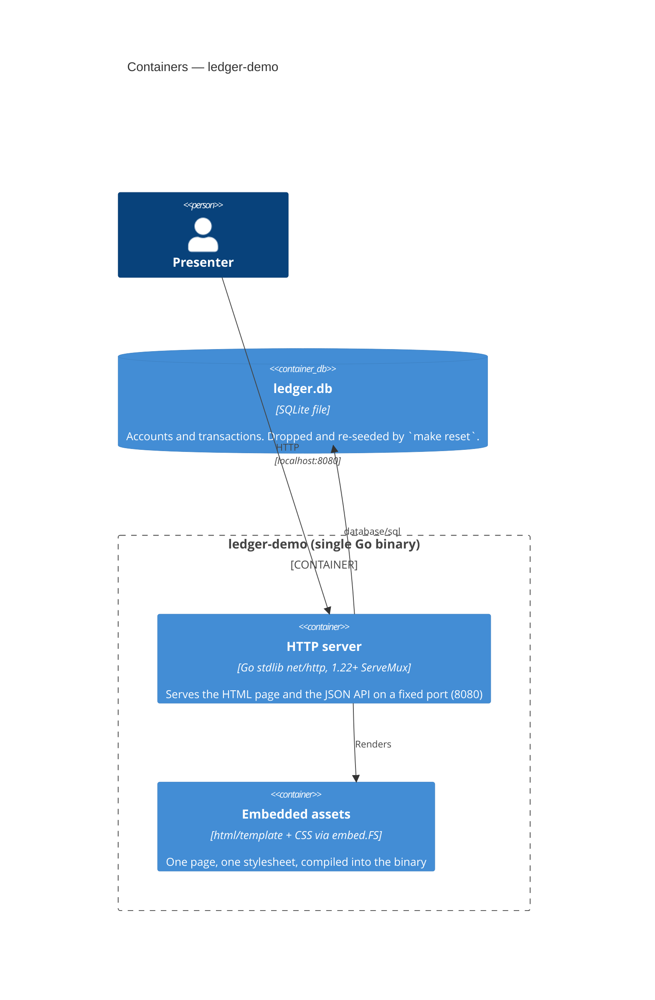

# C4 Level 2 — Containers

**Last updated:** 2026-08-08
**Scope:** Runtime pieces of the single deployable and the file it persists to.
**Status:** Current. Settled by the approved base-ledger spec
(`.docs/specs/2026-08-08-base-ledger.md`) — building the ledger adds no container.

There is exactly one deployable: a single Go binary. No Docker, no reverse proxy, no separate
frontend build — templates and CSS are embedded into the binary via `embed`.

## Commands

| Command | Effect |
|---|---|
| `make dev` | Run the server on port 8080 |
| `make seed` | Drop the DB and load deterministic seed data |
| `make reset` | Restore pristine demo state (drop + re-seed + confirm) |
| `make test` | Run the suite (target: under 10s, fully deterministic) |
| `make check` | `gofmt` + `go vet` — what the pre-PR lint gate runs |

## HTTP surface

Exactly five routes. The count is a constraint, not an observation.

| Route | Serves |
|---|---|
| `GET /` | The page. Account chosen by an `account` query parameter. |
| `GET /style.css` | The stylesheet, from the embedded FS |
| `GET /api/accounts` | Accounts with derived balances (JSON) |
| `GET /api/accounts/«id»/transactions` | That account's transactions, newest first (JSON) |
| `POST /api/accounts/«id»/transactions` | Records a transaction. Content-negotiated: a form-encoded body redirects back to the page, a JSON body returns the created transaction. |

The page carries no JavaScript, so its form is a real form post to that same posting route rather
than a scripted request. See `.docs/architecture/sequences.md` for both response modes.

## Change Log

| Date | Change | Reason |
|------|--------|--------|
| 2026-08-08 | Initial generation | Created during `/bootstrap` |
| 2026-08-08 | Status: Skeleton → Current; added the HTTP surface table | base-ledger DECIDE pass — the five-route surface is now confirmed |
