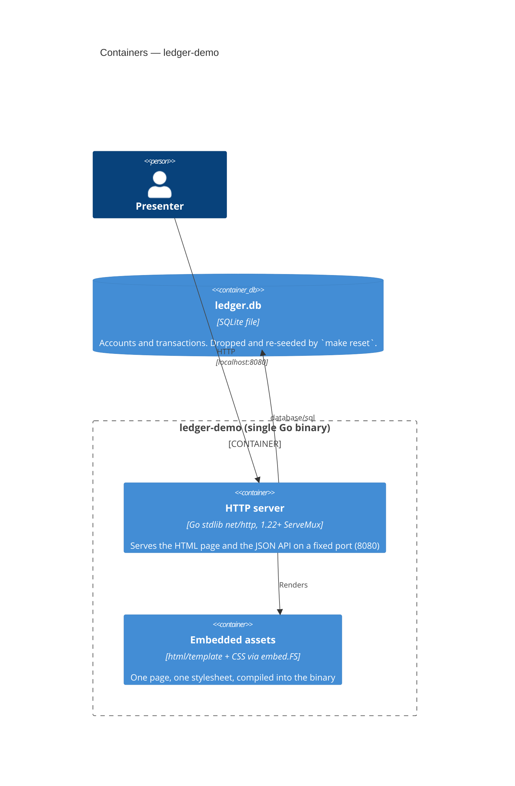

# C4 Level 2 — Containers

**Status:** Skeleton, generated at bootstrap from the scaffold.

There is exactly one deployable: a single Go binary. No Docker, no reverse proxy, no separate
frontend build — templates and CSS are embedded into the binary via `embed`.

## Commands

| Command | Effect |
|---|---|
| `make dev` | Run the server on port 8080 |
| `make seed` | Drop the DB and load deterministic seed data |
| `make reset` | Restore pristine demo state (drop + re-seed + confirm) |
| `make test` | Run the suite (target: under 10s, fully deterministic) |
| `make check` | `gofmt` + `go vet` — what the pre-PR lint gate runs |
