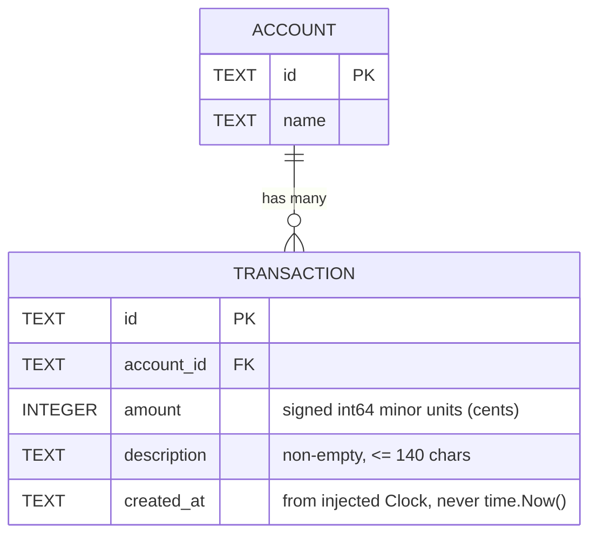

# Entity Relationship Diagram

**Status:** Skeleton — **no schema exists yet.** The tables below are the intended shape from
the spec, not the current database. `internal/store` is empty; the schema is created during the
demo.

## Notes that constrain the schema

- **Balance is NOT a column.** It is derived by folding over an account's transactions. There is
  no stored, mutable balance field anywhere. See
  `.docs/decisions/adr-2026-08-08-money-as-int64-cents.md`.
- **`amount` is an INTEGER of cents**, never a REAL. No floats anywhere, ever.
- **No uniqueness constraint beyond the primary key.** This is deliberate and load-bearing:
  duplicate-charge detection is an explicit non-goal because it is a feature added live on
  stage. Adding a unique index on `(account_id, amount, description)` — or anything similar —
  ruins the demo. See the non-goals list in `CLAUDE.md`.
- **No `pending` / `posted` status column.** Pending transactions and available-vs-posted
  balance are non-goals.
- **No `users` or `tenants` table.** Auth and multi-tenancy are non-goals.
- **No transfer or counter-entry modelling.** This is not double-entry; transfers are a non-goal.
