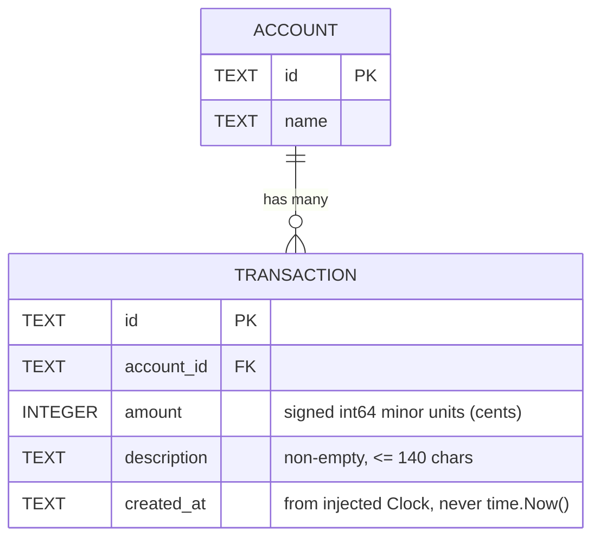

# Entity Relationship Diagram

**Last updated:** 2026-08-08
**Scope:** Every table the ledger has, and the constraints deliberately absent from them.
**Status:** Planned — **no schema exists yet.** The tables below are the shape the approved
base-ledger spec (`.docs/specs/2026-08-08-base-ledger.md`) specifies; `internal/store` will create
them. The shape is unchanged from bootstrap: base-ledger adds no column and no constraint.

## Notes that constrain the schema

- **Balance is NOT a column.** It is derived by folding over an account's transactions. There is
  no stored, mutable balance field anywhere. See
  `.docs/decisions/adr-2026-08-08-money-as-int64-cents.md`.
- **`amount` is an INTEGER of cents**, never a REAL. No floats anywhere, ever.
- **No uniqueness constraint beyond the primary key.** This is deliberate and load-bearing:
  duplicate-charge detection is an explicit non-goal because it is a feature added live on
  stage. Adding a unique index on `(account_id, amount, description)` — or anything similar —
  ruins the demo. See the non-goals list in `CLAUDE.md`.
- **No `pending` / `posted` status column.** Pending transactions and available-vs-posted
  balance are non-goals.
- **No `users` or `tenants` table.** Auth and multi-tenancy are non-goals.
- **No transfer or counter-entry modelling.** This is not double-entry; transfers are a non-goal.

## Identity and ordering

Both follow from determinism (NFR-3 in the spec) and neither adds a column.

- **`id` is assigned sequentially and zero-padded** (`txn-0001`, `txn-0002`, …), derived from the
  count of rows already present. No randomness, so a seeded database is byte-identical on every
  reset and tests can assert exact identifiers.
- **Newest-first is `ORDER BY created_at DESC, id DESC`.** `created_at` alone is not enough: time is
  injected, so every transaction written in a single test shares one timestamp and ordering by
  timestamp alone is undefined between them. The zero-padded `id` sorts lexicographically in
  insertion order, which makes the pair a total order — deterministic without a dedicated sequence
  column.

The rejected alternative was adding a monotonic `seq INTEGER` column and ordering by it. It is more
explicit, but it changes this schema to buy a property the `id` tiebreak already provides.

## Change Log

| Date | Change | Reason |
|------|--------|--------|
| 2026-08-08 | Initial generation | Created during `/bootstrap` |
| 2026-08-08 | Status: Skeleton → Planned; added Identity and ordering | base-ledger DECIDE pass — records the deterministic id + ordering decision without changing the shape |
