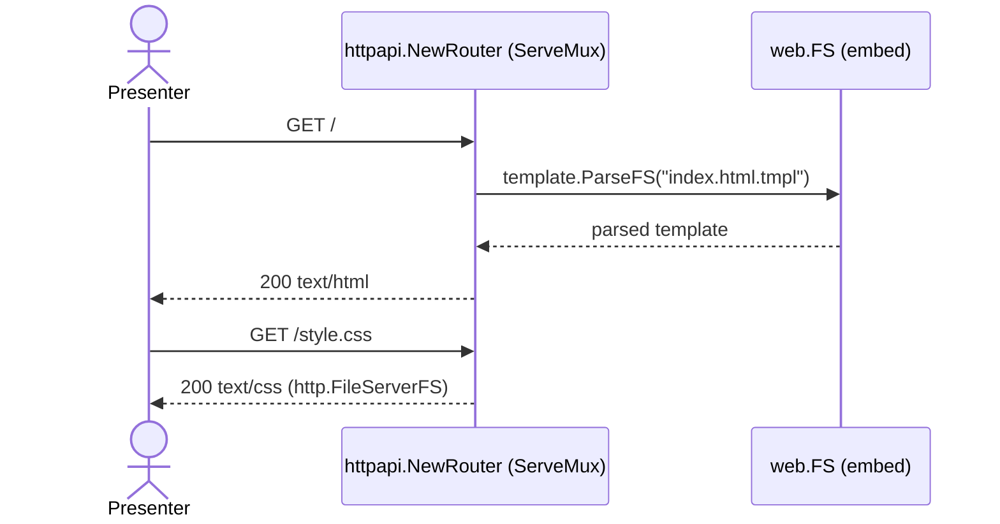
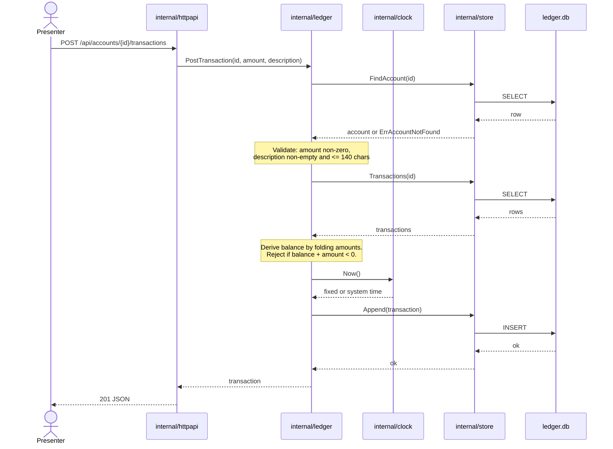

# Sequence Diagrams

**Status:** One implemented flow, one intended flow. Kept in a single file deliberately — this
project optimizes for a small, legible repo.

## 1. `GET /` — render the page (implemented)

Templates are parsed from an embedded FS rather than disk so the server and its tests behave
identically regardless of working directory — Go runs each package's tests with the cwd set to
that package.

## 2. `POST /api/accounts/{id}/transactions` — post a transaction (intended, not built)

This is the flow the demo exercises. It is drawn here so the shape is agreed before it is
built, not because it exists.

### Known characteristic, deliberately not addressed

The balance check is **read-then-write with no lock**: the derived balance is computed, then the
insert happens. Two concurrent posts could both observe a sufficient balance and both succeed.

This is left alone on purpose. It is irrelevant at demo scale (one presenter, one browser), and
serialising it would mean adding transaction-isolation machinery that makes the code harder to
read on a projector. It is documented here so it is a known property rather than a discovered
surprise — and it is worth knowing that it sits close to the concurrency and duplicate-posting
territory a live feature may touch.

## Error rendering

Domain sentinels map to typed JSON codes plus a human-readable message
(`.docs/decisions/adr-2026-08-08-sentinel-errors-for-domain-failures.md`). The HTML page renders
errors visibly rather than silently swallowing them.
