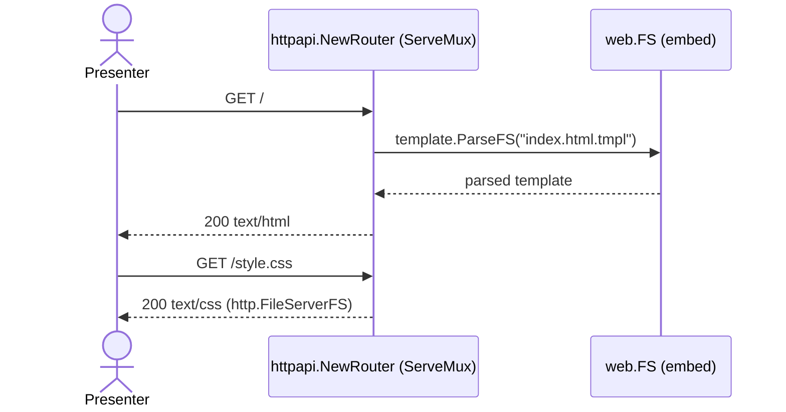
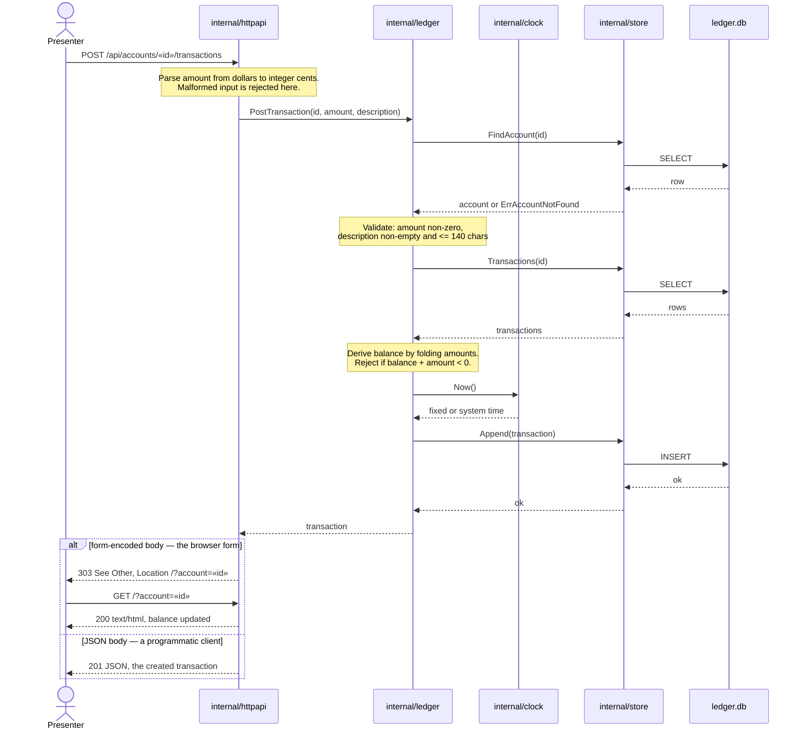
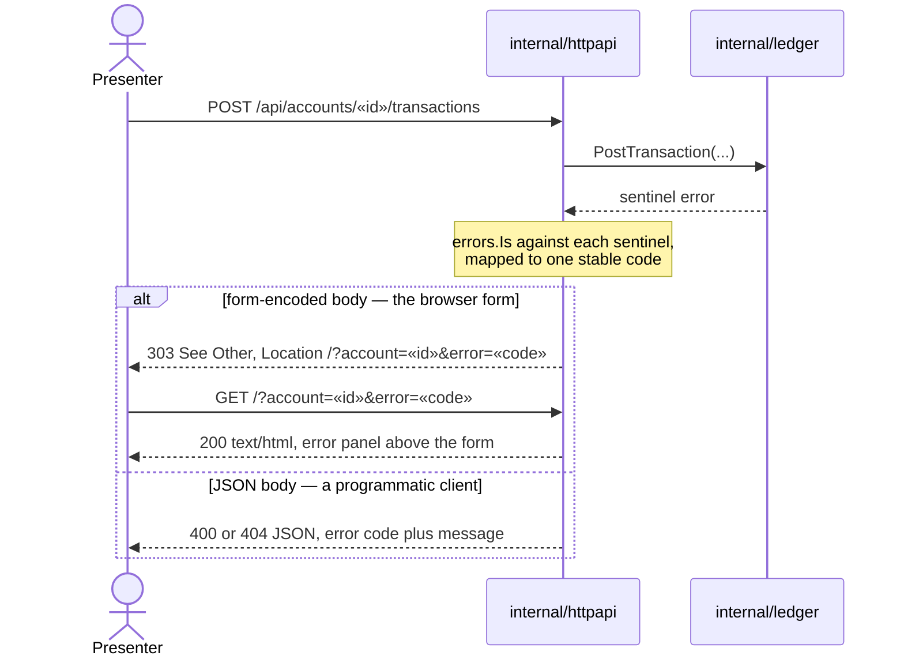

# Sequence Diagrams

**Last updated:** 2026-08-08
**Scope:** The two request flows that matter. Kept in a single file deliberately — this project
optimizes for a small, legible repo, so flows are not split one-per-file.
**Status:** One implemented flow, one specified-and-approved flow
(`.docs/specs/2026-08-08-base-ledger.md`).

## 1. `GET /` — render the page (implemented)

Templates are parsed from an embedded FS rather than disk so the server and its tests behave
identically regardless of working directory — Go runs each package's tests with the cwd set to
that package.

## 2. `POST /api/accounts/«id»/transactions` — post a transaction (specified, not yet built)

This is the flow the demo exercises. It is drawn here because the shape is agreed, not because it
exists.

**One endpoint serves two callers.** The page carries no JavaScript, so its form is a real form post
to this same route. The response mode is chosen by the request's content type: a form-encoded body
gets a redirect back to the page (so a reload does not record the transaction twice), a JSON body
gets the created transaction.

### When a rule rejects

The domain returns a sentinel; the boundary maps it to exactly one stable code
(`.docs/decisions/api-response-contract.md`). Nothing is written.

### Known characteristic, deliberately not addressed

The balance check is **read-then-write with no lock**: the derived balance is computed, then the
insert happens. Two concurrent posts could both observe a sufficient balance and both succeed.

This is left alone on purpose. It is irrelevant at demo scale (one presenter, one browser), and
serialising it would mean adding transaction-isolation machinery that makes the code harder to
read on a projector. It is documented here so it is a known property rather than a discovered
surprise. No requirement in the base-ledger spec asks for it to be addressed.

## Error rendering

Domain sentinels map to typed JSON codes plus a human-readable message
(`.docs/decisions/adr-2026-08-08-sentinel-errors-for-domain-failures.md`). The HTML page renders
errors visibly rather than silently swallowing them.

## Change Log

| Date | Change | Reason |
|------|--------|--------|
| 2026-08-08 | Initial generation | Created during `/bootstrap` |
| 2026-08-08 | POST flow shows both response modes; added the rejection flow; `{id}` → `«id»`; trimmed a trailing aside from the known-characteristic note | base-ledger DECIDE pass — one endpoint now serves the browser form and programmatic clients |
