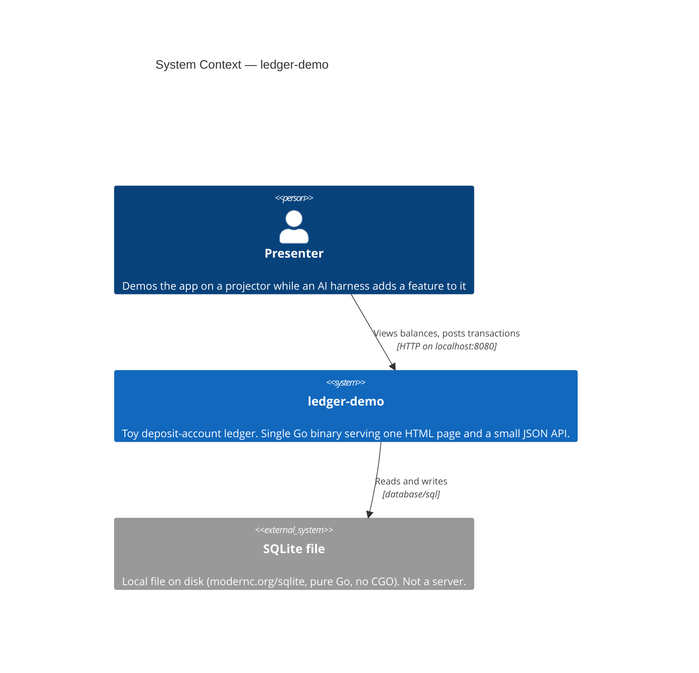

# C4 Level 1 — System Context

**Status:** Skeleton, generated at bootstrap from the scaffold. Will be populated as the
domain is built.

`ledger-demo` is deliberately isolated: **zero network calls, zero external services**. The
only actor is the presenter, and the only dependency is a local SQLite file.

## Notes

- There is no third party, no API, no auth provider, and no message broker. Anything of that
  shape is an explicit non-goal.
- SQLite is drawn as external only because it is a distinct persistence boundary; it is a file
  in the working directory, not a running service.
- The presenter is the only actor. There are no users, sessions, or tenants.
