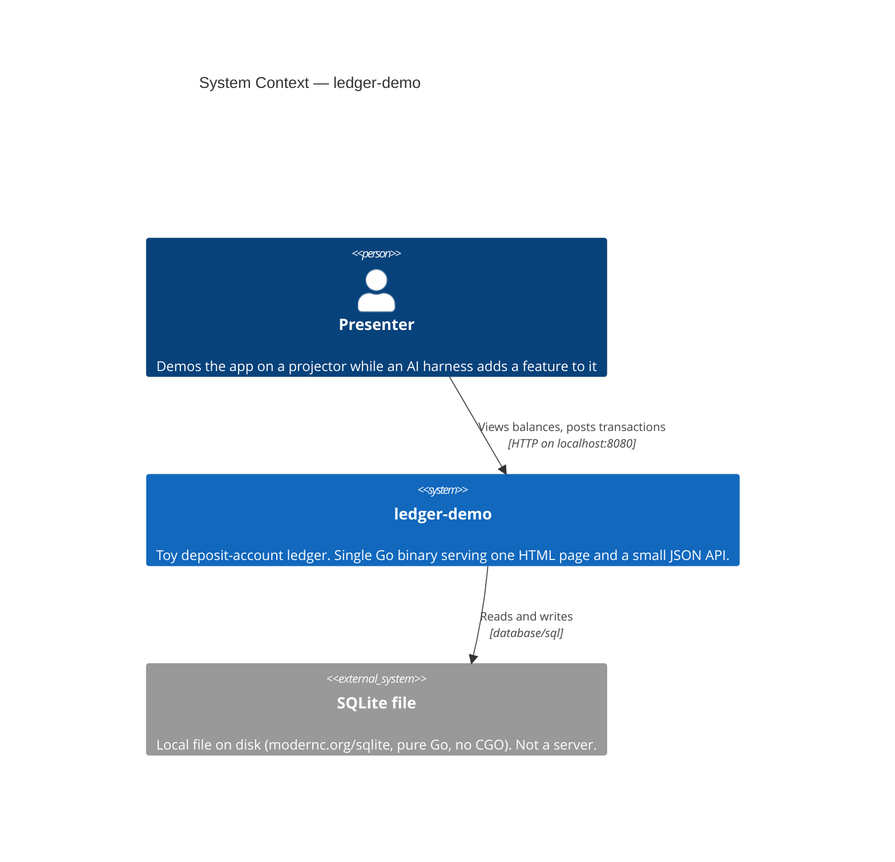

# C4 Level 1 — System Context

**Last updated:** 2026-08-08
**Scope:** The whole system and everything outside it.
**Status:** Current. Settled by the approved base-ledger spec
(`.docs/specs/2026-08-08-base-ledger.md`) — building the ledger does not change this level,
because it adds no actor and no external dependency.

`ledger-demo` is deliberately isolated: **zero network calls, zero external services**. The
only actor is the presenter, and the only dependency is a local SQLite file.

## Notes

- There is no third party, no API, no auth provider, and no message broker. Anything of that
  shape is an explicit non-goal.
- SQLite is drawn as external only because it is a distinct persistence boundary; it is a file
  in the working directory, not a running service.
- The presenter is the only actor. There are no users, sessions, or tenants.
- A programmatic client (`curl`, or the harness itself during a demo) reaches the same binary over
  the same localhost HTTP surface. It is not drawn as a separate actor because it crosses no new
  boundary — it is the presenter by another means.

## Change Log

| Date | Change | Reason |
|------|--------|--------|
| 2026-08-08 | Initial generation | Created during `/bootstrap` |
| 2026-08-08 | Status: Skeleton → Current; noted the programmatic client | base-ledger DECIDE pass — the spec settles this level unchanged |
